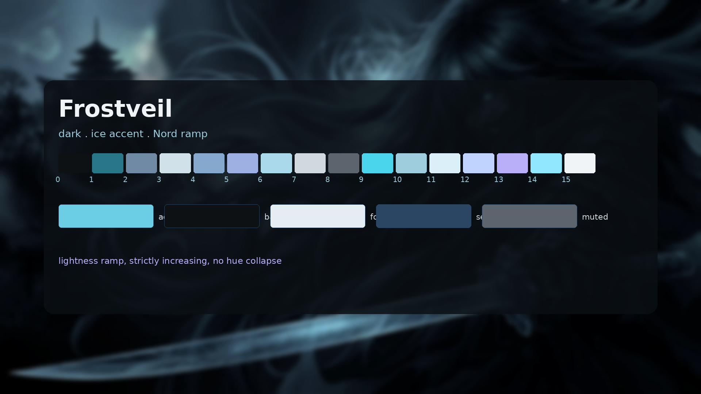

# Frostveil



A dark Omarchy theme built around a single ice accent on a cool, almost-black
base. The colour follows a strict lightness ramp (the philosophy of
[Solitude](https://github.com/omarchy?q=solitude)): grey-blue slots climb in
luminance in clear steps, two slots carry real ice colour, and the bottom of the
desktop stays dark so text always reads first. The active window border carries
a gradient that fades through slate to the background at the centre of the
edge, so windows read as lit at the corners and dim in the middle.

## Palette

| Role | Colour |
|---|---|
| Background | `#0e1114` |
| Foreground | `#e4edf2` |
| Accent (deep ice) | `#2c7190` |
| Selection bg / bright ice | `#6bcee5` |
| Selection fg | `#0e1114` |
| Muted | `#5c646d` |
| Dark surface | `#2b4663` |
| Nord/ice (color4, color12) | `#86a8cc` / `#c0d3ff` |
| Ice standout (color1, color9) | `#277789` / `#4bd5ec` |

`colors.toml` defines the sixteen `color0`–`color15` slots; the named tokens
(`red`, `green`, `yellow`, `blue`, `magenta`, `cyan`) and their `bright_`
counterparts are resolved from them by Omarchy. Note that `orange` resolves to
the same value as `yellow` (`#d1e1e9`): the ramp has no separate orange slot,
and templates that ask for `orange` get the pale yellow.

The 16-colour ANSI ramp is defined in `colors.toml` and is what terminals, btop
and the shell all read, so editing `colors.toml` updates the whole desktop.
Every `bright_*` slot is genuinely lighter than its `regular_*` counterpart so
that bold text and TUI key hints stay legible, and no two of the sixteen slots
share a value, so neighbouring hues can never collapse into each other.

Lightness is not monotonic across `color0`–`color7`, and that is deliberate.
`color3` (yellow) is the lightest slot in the normal range at Y≈0.73, because
yellow reads as a highlight when it is pale; the ramp then steps back down to
`color4` (blue, Y≈0.37) before rising again through magenta and cyan to
`color7`. So `color4`–`color7` is a strictly increasing run, and `color1`–`color3`
is another, with the yellow peak between them. Sorting the ramp by lightness
rather than by slot index is what keeps a TUI's "brightest" colours from
sitting in the middle of the scale. Neovim is generated from the same ramp,
see [Neovim](#neovim) below.

### Two ice blues

Frostveil carries two accent blues. The `accent` token is the **deep ice**
`#2c7190`: it is what app buttons read (omawrite, for example, paints its
primary button with the theme's `accent` and hardcodes white text), and white on
`#2c7190` clears WCAG AA (5.42:1). The **bright ice** `#6bcee5` is reserved for
surfaces that sit on the dark background, where it is the selection tint,
the polkit glyph, the launcher/menu selected text and the notification
countdown. The shell sections that must keep bright ice — `[bar]`,
`[notifications]`, `[menu]`, `[launcher]`, `[polkit]`, `[lock]` and
`[image-picker]` — are pinned through `shell.<section>.toml` overrides, which
Omarchy merges into the generated `shell.toml` at theme-set time.

## Border gradient

The gradient lives in one field and drives both Hyprland windows and the
shell's popups:

```toml
hyprland_active_border = "#8fa3b5 #3f5a70 #1a2736 #3f5a70 #8fa3b5"
```

Dropping the trailing `deg` angle gives the horizontal default. `90deg` is
vertical, `45deg` diagonal. Note that Hyprland maps a linear gradient across the
whole window box, so `45deg` and `0deg` skew on non-square windows; the
horizontal default is the one that stays balanced across aspect ratios.

```toml
hyprland_active_border = "#8fa3b5 #3f5a70 #1a2736 #3f5a70 #8fa3b5"
```

The centre stops drop toward the background so the gradient visibly fades
across the edge — grey-blue steel at the corners, night in the middle, in the
same desaturated family as Solitude's border.

## Background

`backgrounds/BG2.webp` is an AI-generated glacial image whose visible colour
sits at hue ~241° (Nord), in the same cool family as the accent, with its
lighter area at the top of the screen where little sits. It is veiled (gamma
darkened to a mean luminance just above the theme background, 95% of pixels
below Y 0.085) so the wallpaper never competes with either the UI accent or
terminal text, and stored as WebP q82 (197 KiB) to keep the repository light.

## Files

| File | Applies to |
|---|---|
| `colors.toml` | source of truth, drives every template below |
| `hyprland.conf` | window/decoration settings and colours |
| `hyprlock.conf` | lock screen colours |
| `foot.ini` | foot, the default Omarchy terminal |
| `alacritty.toml`, `ghostty.conf`, `kitty.conf`, `warp.yaml` | other terminals |
| `gtk.css` | GTK4 / Adwaita apps |
| `vencord.theme.css` | Discord (Vencord) |
| `chromium.theme` | Chromium/ungoogled-chromium window frame |
| `icons.theme` | icon set (`Yaru-prussiangreen-dark`) |
| `walker.css`, `wofi.css`, `swayosd.css`, `waybar.css`, `mako.ini` | shell surfaces |
| `shell.bar.toml` | overrides the generated `[bar]` section in `shell.toml` (urgent/attention colour) |
| `shell.notifications.toml` | overrides `[notifications]` (keeps the countdown on bright ice) |
| `shell.menu.toml` | overrides `[menu]` (selected-text stays bright ice) |
| `shell.launcher.toml` | overrides `[launcher]` (selected-text stays bright ice) |
| `shell.polkit.toml` | overrides `[polkit]` (accent glyph stays bright ice) |
| `shell.lock.toml` | overrides `[lock]` (input selection stays bright ice) |
| `shell.image-picker.toml` | overrides `[image-picker]` (selected border stays bright ice) |
| `obsidian.css` | Obsidian editor |
| `backgrounds/BG2.webp` | desktop background |
| `preview.png` | preview shown in the theme switcher |

### Files that `omarchy theme install` does not copy

Omarchy deliberately drops a few files when installing a theme from a git
repository, because they can name a program to launch. **These files are in the
repository for you to copy by hand, but installing the theme will not put them
on your machine:**

| File | Why it is skipped |
|---|---|
| `alacritty.toml`, `ghostty.conf`, `kitty.conf`, `foot.ini` | terminal configs name the program to launch |

Everything else — `colors.toml`, `backgrounds/`, `preview.png`,
`hyprland.conf`, `hyprlock.conf`, the CSS files, `chromium.theme`,
`icons.theme` and the `shell.<section>.toml` overrides — is installed
normally and needs no manual step.

If you want the skipped ones, the instructions are below.

## Neovim

Omarchy generates a Neovim spec from `colors.toml` on every `omarchy theme set`
and writes it to `~/.local/state/omarchy/current/theme/neovim.lua`. That spec
drives [aether.nvim](https://github.com/bjarneo/aether.nvim) — `bg`, `fg`,
`muted`, `selection`, the full ANSI ramp and the `accent` — so the editor is
coloured straight from this palette rather than from a second one kept in sync
by hand.

Nothing installs that spec for you, because it belongs to your Neovim config.
Point LazyVim at it with a symlink:

```bash
ln -sf ~/.local/state/omarchy/current/theme/neovim.lua \
        ~/.config/nvim/lua/plugins/theme.lua
```

The name matters. Omarchy's `omarchy-theme-hotreload.lua` looks for
`plugins.theme` to re-colour the editor when you switch themes, so a symlink
named anything else (an older `plugins/neovim.lua`, say) silently disables
hot-reloading. With the symlink in place, `LazyVim/LazyVim` picks up
`colorscheme = "aether"` from the spec and the editor follows the desktop.

Restart Neovim afterwards. If Aether does not appear, run `:Lazy sync` once.

If you prefer a colorscheme that stands apart from the UI, delete the symlink
and set your own `colorscheme` in `~/.config/nvim/lua/plugins/` instead.

## Terminals

The terminal configs are **not** installed automatically. Each one is a drop-in
file you copy to the right place. You only need the one for the terminal you
use.

### foot (Omarchy's default)

`foot.ini` is a complete standalone config: the full Frostveil palette plus a
translucent blurred background, an 11pt JetBrainsMono Nerd Font, a beam cursor
and 10 000 lines of scrollback.

```bash
THEME=~/.config/omarchy/themes/frostveil
mkdir -p ~/.config/foot
cp "$THEME/foot.ini" ~/.config/foot/foot.ini
omarchy restart terminal
```

Because a theme-supplied `foot.ini` is never regenerated, **editing
`colors.toml` will no longer update foot** — the palette in `foot.ini` is a
copy. If you change the palette, mirror it in the `[colors-dark]` section of
your `foot.ini` too.

Prefer to keep foot tied to the palette? Delete `foot.ini` from your copy of
the theme. Omarchy then regenerates it from `colors.toml` on every
`omarchy theme set`, and you can still get the look by adding just the
presentation settings to `~/.config/foot/foot.ini`:

```ini
[main]
include=~/.local/state/omarchy/toggles/foot.ini
include=~/.local/state/omarchy/current/theme/foot.ini
term=xterm-256color
font=JetBrainsMono Nerd Font:size=11
pad=14x14
initial-window-mode=windowed
workers=0

[colors-dark]
blur=yes
alpha=0.95

[scrollback]
lines=10000
multiplier=7.0

[cursor]
style=beam
blink=yes
```

This second form is the more flexible one: colours stay generated from
`colors.toml`, and only the presentation is yours.

### Other terminals

```bash
THEME=~/.config/omarchy/themes/frostveil

# Alacritty
mkdir -p ~/.config/alacritty && cp "$THEME/alacritty.toml" ~/.config/alacritty/

# Ghostty
mkdir -p ~/.config/ghostty && cp "$THEME/ghostty.conf"    ~/.config/ghostty/config

# Kitty
mkdir -p ~/.config/kitty && cp "$THEME/kitty.conf"        ~/.config/kitty/

# Warp
mkdir -p ~/.config/warp-terminal/themes && cp "$THEME/warp.yaml" ~/.config/warp-terminal/themes/
```

## Look'n'feel

Omarchy does not source `hyprland.conf` automatically. Hyprland reads the
generated `hyprland.lua`, which already carries the border gradient, so the
theme alone gives you the palette and the border. The rest of the look'n'feel —
gaps, blur, shadows, dimming, tearing — is in `hyprland.conf` and has to be
applied by you.

The settings it carries are:

| Setting | Value |
|---|---|
| Gaps | `gaps_in = 4`, `gaps_out = 8` |
| Border size | `border_size = 2` |
| Blur | `size = 10`, `passes = 2`, `new_optimizations = true` |
| Shadow | `range = 16`, `color = rgba(00000052)` |
| Motion blur | enabled |
| Dim inactive | `dim_inactive = true`, `dim_strength = 0.5` |
| Tearing | `allow_tearing = true` |
| Layout | `dwindle` |
| Rounding | not forced (Omarchy's default) |

You have two ways to apply them.

**Option A — source the file.** Add this to the bottom of
`~/.config/hypr/hyprland.lua`, after the Omarchy requires:

```lua
source = (os.getenv("HOME") .. "/.config/omarchy/themes/frostveil/hyprland.conf")
```

**Option B — copy the settings.** Add them to
`~/.config/hypr/looknfeel.lua`, which Omarchy already loads for you. This is
the tidier option because it keeps your own config self-contained:

```lua
hl.config({
  general = {
    allow_tearing = true,
    gaps_in = 4,
    gaps_out = 8,
    border_size = 2,
  },
  decoration = {
    motion_blur = { enabled = true },
    blur = {
      enabled = true,
      size = 10,
      passes = 2,
      new_optimizations = true,
    },
    shadow = {
      enabled = true,
      range = 16,
      color = "rgba(00000052)",
    },
    dim_inactive = true,
    dim_strength = 0.5,
  },
})
```

Then reload Hyprland:

```bash
hyprctl reload
```

**Lock screen.** `hyprlock.conf` only defines colours. Source it from your own
hyprlock config to get a matching lock screen:

```conf
source = ~/.config/omarchy/themes/frostveil/hyprlock.conf
```

## Install

```bash
omarchy theme install frostveil
```

Or from the URL directly:

```bash
omarchy theme install https://github.com/amaurisd97/omarchy-frostveil-theme.git
```

Then apply it:

```bash
omarchy theme set "Frostveil"
```

Cycle through the bundled background with `omarchy theme bg next`.

## Credits

- The original file layout and the general structure come from
  [Vengeance](https://github.com/Grey-007/vengeance) by Grey-007.
- The ramp philosophy — a desaturated palette separated by strictly increasing
  lightness rather than by hue — follows the stock
  [Solitude](https://github.com/omarchy/solitude) theme.
- Neovim is coloured by [aether.nvim](https://github.com/bjarneo/aether.nvim)
  from the generated spec, not by a dependency bundled here.
- The wallpaper was generated with AI image tools and is released under the
  same MIT license as the theme.

## License

MIT. See [LICENSE](LICENSE), and [NOTICE](NOTICE) for the credits that go with
it.